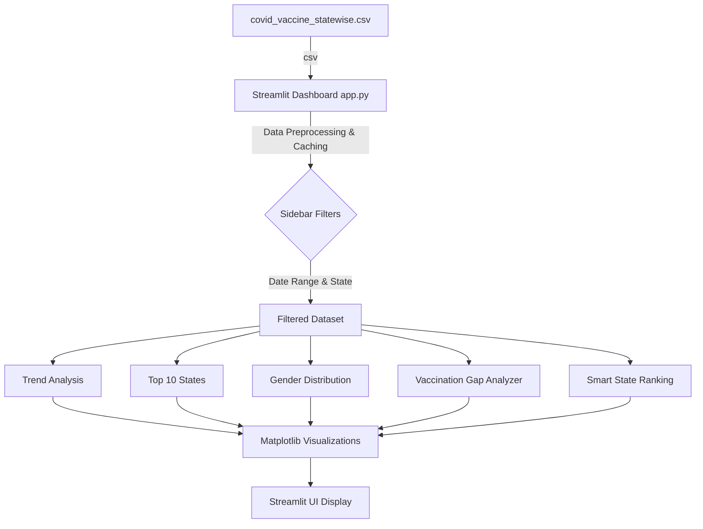

# COVID-19 Vaccination Dashboard

## System Architecture

```mermaid
graph TD
    A[covid_vaccine_statewise.csv] -->|csv| B[Streamlit Dashboard app.py]
    B -->|Data Preprocessing & Caching| C{Sidebar Filters}
    C -->|Date Range & State| D[Filtered Dataset]
    
    D --> E[Trend Analysis]
    D --> F[Top 10 States]
    D --> G[Gender Distribution]
    D --> H[Vaccination Gap Analyzer]
    D --> I[Smart State Ranking]
    
    E --> J[Matplotlib Visualizations]
    F --> J
    G --> J
    H --> J
    I --> J
    
    J --> K[Streamlit UI Display]
```
